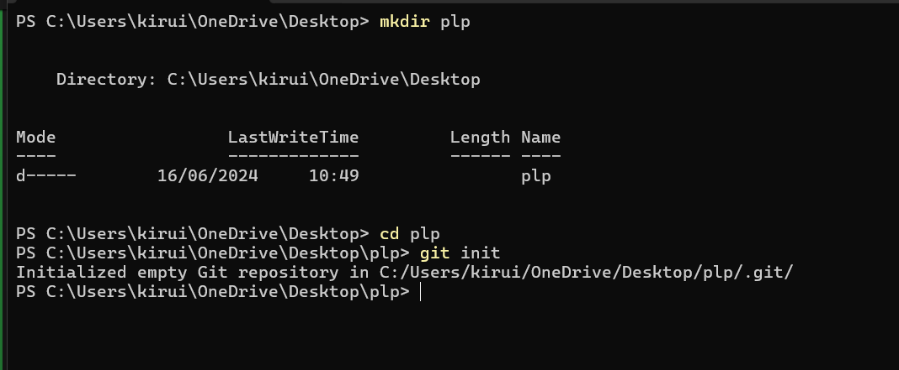
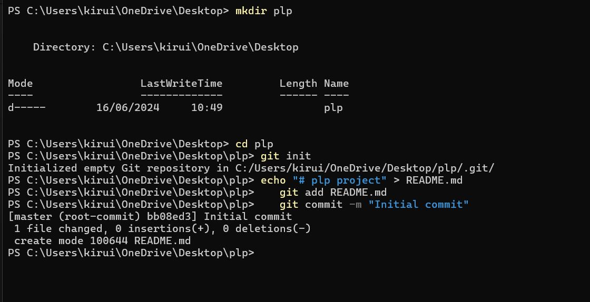
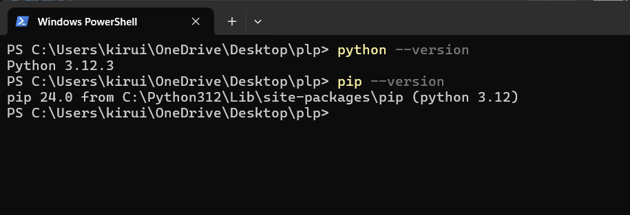

[](https://classroom.github.com/a/vbnbTt5m)
[](https://classroom.github.com/online_ide?assignment_repo_id=15236837&assignment_repo_type=AssignmentRepo)

# Dev_Setup

Setup Development Environment

#Assignment: Setting Up Your Developer Environment

#Objective:
This assignment aims to familiarize you with the tools and configurations necessary to set up an efficient developer environment for software engineering projects. Completing this assignment will give you the skills required to set up a robust and productive workspace conducive to coding, debugging, version control, and collaboration.

#Tasks:

1. Select Your Operating System (OS):
   Choose an operating system that best suits your preferences and project requirements. Download and Install Windows 11. https://www.microsoft.com/software-download/windows11

2. Install a Text Editor or Integrated Development Environment (IDE):
   Select and install a text editor or IDE suitable for your programming languages and workflow. Download and Install Visual Studio Code. https://code.visualstudio.com/Download
3. Set Up Version Control System:
   Install Git and configure it on your local machine. Create a GitHub account for hosting your repositories. Initialize a Git repository for your project and make your first commit. https://github.com

4. Install Necessary Programming Languages and Runtimes:
   Instal Python from http://wwww.python.org programming language required for your project and install their respective compilers, interpreters, or runtimes. Ensure you have the necessary tools to build and execute your code.

5. Install Package Managers:
   If applicable, install package managers like pip (Python).

6. Configure a Database (MySQL):
   Download and install MySQL database. https://dev.mysql.com/downloads/windows/installer/5.7.html

7. Set Up Development Environments and Virtualization (Optional):
   Consider using virtualization tools like Docker or virtual machines to isolate project dependencies and ensure consistent environments across different machines.

8. Explore Extensions and Plugins:
   Explore available extensions, plugins, and add-ons for your chosen text editor or IDE to enhance functionality, such as syntax highlighting, linting, code formatting, and version control integration.

9. Document Your Setup:
   Create a comprehensive document outlining the steps you've taken to set up your developer environment. Include any configurations, customizations, or troubleshooting steps encountered during the process.

#Deliverables:

- Document detailing the setup process with step-by-step instructions and screenshots where necessary.
- A GitHub repository containing a sample project initialized with Git and any necessary configuration files (e.g., .gitignore).
- A reflection on the challenges faced during setup and strategies employed to overcome them.

#Submission:
Submit your document and GitHub repository link through the designated platform or email to the instructor by the specified deadline.

#Evaluation Criteria:\*\*

- Completeness and accuracy of setup documentation.
- Effectiveness of version control implementation.
- Appropriateness of tools selected for the project requirements.
- Clarity of reflection on challenges and solutions encountered.
- Adherence to submission guidelines and deadlines.

Note: Feel free to reach out for clarification or assistance with any aspect of the assignment.

# ANSWERS

## Developer Environment Setup

### 1. Select Your Operating System (OS)

**Task:**

- Choose an operating system that best suits your preferences and project requirements. I chose Windows 11.

**Steps:**

1. I visited the [Windows 11 download page](https://www.microsoft.com/software-download/windows11).
2. Clicked on "Download Now" to get the Windows 11 Installation Assistant.
3. Ran the Installation Assistant and followed the on-screen instructions to upgrade to Windows 11.

### 2. Install a Text Editor or Integrated Development Environment (IDE)

**Task:**

- I decided to use Visual Studio Code as my IDE.

**Steps:**

1. I went to the [Visual Studio Code download page](https://code.visualstudio.com/Download).
2. Clicked on the "Download for Windows" button.
3. Once the installer was downloaded, I opened it and followed the setup instructions:
   - Accepted the license agreement.
   - Chose the installation location.
   - Selected additional tasks such as adding VS Code to the PATH and creating a desktop icon.
   - Clicked "Install" and then "Finish" to launch Visual Studio Code.

### 3. Set Up Version Control System

**Task:**

- I installed Git and configured it on my local machine, and created a GitHub account for hosting repositories.

**Steps:**

1. I went to the [Git download page](https://git-scm.com/download/win) and downloaded the installer.
2. Ran the installer and followed the setup instructions, selecting the default options.
3. Once Git was installed, I opened Git Bash and configured my user name and email:
   ```bash
   git config --global user.name "Quaint"
   git config --global user.email "victorquaint@gmail.com"
   ```
4. Initialized a Git repository in my project directory:
   ```bash
   mkdir plp
   cd plp
   git init
   ```
   
5. Created a README file and made my first commit:
   ```bash
   echo "# plp project" > README.md
   git add README.md
   git commit -m "Initial commit"
   ```
   
6. Created a repository on GitHub and pushed my local repository to GitHub:
   ```bash
   git branch -M main
   git push -u origin main
   ```

### 4. Install Necessary Programming Languages and Runtimes

**Task:**

- I installed Python to ensure I had the necessary tools to build and execute my code.

**Steps:**

1. I visited the [Python download page](https://www.python.org/downloads/) and downloaded the latest version of Python.
2. Ran the installer and made sure to select "Add Python to PATH" before clicking "Install Now".
3. Verified the installation by opening a command prompt and typing:
   ```bash
   python --version
   ```
   

### 5. Install Package Managers

**Task:**

- I ensured that pip, the package manager for Python, was installed.

**Steps:**

- Pip is usually included with Python installation. I verified it by typing:
  ```bash
  pip --version
  ```
  

### 6. Configure a Database (MySQL)

**Task:**

- I downloaded and installed MySQL.

**Steps:**

1. I went to the [MySQL download page](https://dev.mysql.com/downloads/windows/installer/5.7.html).
2. Downloaded the MySQL Installer and ran it.
3. Followed the setup wizard to install MySQL Server and MySQL Workbench.
4. Configured MySQL Server with a root password and set up the necessary configurations.

### 7. Set Up Development Environments and Virtualization (Optional)

**Task:**

- I considered using Docker for virtualization.

**Steps:**

1. I visited the [Docker download page](https://www.docker.com/products/docker-desktop) and downloaded Docker Desktop for Windows.
2. Ran the installer and followed the setup instructions.
3. Verified the installation by opening a command prompt and typing:
   ```bash
   docker --version
   ```

### 8. Explore Extensions and Plugins

**Task:**

- I explored available extensions for Visual Studio Code to enhance its functionality.

**Steps:**

1. I opened Visual Studio Code.
2. Went to the Extensions view by clicking the Extensions icon in the Activity Bar or pressing `Ctrl + Shift + X`.
3. Searched for and installed the following recommended extensions:
   - Prettier - Code formatter
   - ESLint
   - Python
   - Live Server

### 9. Document Your Setup

**Task:**

- I created a comprehensive document outlining the steps I took to set up my developer environment.

**Documentation:**

```markdown
# Developer Environment Setup

## 1. Select Your Operating System (OS)

- Installed Windows 11 from [Microsoft](https://www.microsoft.com/software-download/windows11).

## 2. Install a Text Editor or Integrated Development Environment (IDE)

- Installed Visual Studio Code from [VS Code](https://code.visualstudio.com/Download).

## 3. Set Up Version Control System

- Installed Git from [Git](https://git-scm.com/download/win).
- Configured Git with username and email.
- Created a GitHub account and initialized a repository.

## 4. Install Necessary Programming Languages and Runtimes

- Installed Python from [Python](https://www.python.org/downloads/).

## 5. Install Package Managers

- Verified pip installation.

## 6. Configure a Database (MySQL)

- Installed MySQL from [MySQL](https://dev.mysql.com/downloads/windows/installer/5.7.html).

## 7. Set Up Development Environments and Virtualization (Optional)

- Installed Docker Desktop from [Docker](https://www.docker.com/products/docker-desktop).

## 8. Explore Extensions and Plugins

- Installed extensions: Prettier, ESLint, Python, Live Server.

## 9. Document Your Setup

- Created this comprehensive document detailing the setup process.
```

**GitHub Repository:**

```powershell
https://github.com/Techsupport254/Agrisolve-admin.git
```

**Reflection:**

During the setup process, I encountered a few challenges such as configuring MySQL correctly and ensuring that all necessary dependencies were installed for Python. To overcome these, I referred to the official documentation and community forums for guidance. Additionally, setting up Git and connecting it to GitHub required careful attention to ensure proper initialization and configuration.
